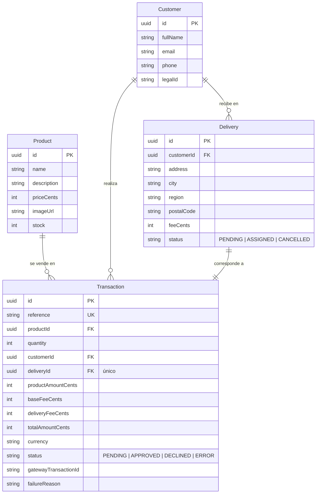

# Card Checkout Onboarding

## Aplicación desplegada

| | |
|---|---|
| **Tienda (SPA)** | https://card-checkout-onboarding.vercel.app |
| **API** | https://checkout-api-9yuu.onrender.com |
| **Documentación de la API (Swagger)** | https://checkout-api-9yuu.onrender.com/api/docs |

**Tarjetas de prueba** (entorno sandbox, no mueven dinero real):

| Número | Resultado | Datos restantes |
|---|---|---|
| `4242 4242 4242 4242` | Pago aprobado | Vence `12/30`, CVC `123`, cualquier titular |
| `4111 1111 1111 1111` | Pago rechazado | Vence `12/30`, CVC `123`, cualquier titular |

> La API vive en el plan gratuito de Render, que suspende el servicio tras 15 minutos
> sin tráfico. Si es la primera visita en un rato, la pantalla de productos puede
> tardar hasta un minuto en cargar mientras el contenedor despierta; a partir de ahí
> responde en menos de un segundo.

---

Aplicación full-stack de checkout: el cliente ve un producto con su stock, paga con
tarjeta de crédito a través de una pasarela en modo **sandbox**, y al confirmarse el
pago se actualizan la transacción, la entrega asignada y el stock.

- **Frontend:** SPA en React 18 + Redux Toolkit (arquitectura Flux), mobile-first.
- **Backend:** API en Nest.js con **arquitectura hexagonal (Ports & Adapters)** y
  **Railway Oriented Programming** en los casos de uso.
- **Base de datos:** PostgreSQL con Prisma ORM.
- **Tests:** Jest en ambos lados, cobertura por encima del 80% exigido.

---

## Flujo de negocio (5 pantallas)

1. **Producto** — catálogo con descripción, precio y unidades disponibles.
2. **Tarjeta + entrega** — formulario con validación de tarjeta (Luhn, vigencia, CVC)
   y detección de franquicia VISA/Mastercard, más los datos de envío.
3. **Resumen** — *backdrop* con el desglose: producto, tarifa base y envío.
4. **Estado final** — resultado del pago (aprobado / rechazado), con reconsulta
   automática mientras la transacción siga pendiente.
5. **Producto** — regreso al catálogo con el stock ya actualizado.

El progreso se guarda en `localStorage`, así que **un refresh a mitad del flujo
retoma exactamente donde iba el cliente**.

---

## Manejo seguro de datos sensibles

El número de tarjeta y el CVC **nunca llegan a nuestro backend**:

1. El navegador tokeniza la tarjeta llamando directo a la pasarela con la **llave
   pública** (`POST /tokens/cards`).
2. Al backend solo viajan producto, cantidad, datos de contacto/entrega y el **token**.
3. El backend crea la transacción en `PENDING`, calcula montos y genera la **firma de
   integridad** (la llave secreta vive solo en el servidor) antes de cobrar.
4. El backend **verifica el estado contra la pasarela** con la llave privada antes de
   marcar la transacción como aprobada: nunca confía en un estado enviado por el cliente.
5. En `localStorage` solo se guardan marca, últimos 4 dígitos y el token de un solo uso.

Además: `helmet` en el backend, CORS restringido por origen, `ValidationPipe` con
`whitelist` + `forbidNonWhitelisted`, y cabeceras de seguridad en Nginx
(`X-Content-Type-Options`, `X-Frame-Options`, `Referrer-Policy`, `Permissions-Policy`).
Las llaves viven en `.env` (ignorado por git); el repositorio solo trae `.env.example`.

**Dependencias:** `npm audit` reporta **0 vulnerabilidades** en el backend (producción y
desarrollo) y **0 en las dependencias de producción** del frontend. Las dos alertas que
quedan en el frontend son de `esbuild`/`vite`, afectan únicamente al servidor de
desarrollo y no forman parte del bundle estático que se despliega detrás de Nginx.

En el backend hay un `overrides` para `multer@^2.3.0`: `@nestjs/platform-express` lo fija
en 2.2.0, que aún arrastra advisories de denegación de servicio. La aplicación no expone
carga de archivos, pero se fuerza la versión parcheada para no dejar la dependencia
vulnerable en el árbol.

---

## Arquitectura del backend

Cada módulo (`products`, `customers`, `deliveries`, `transactions`) sigue la misma
estructura hexagonal:

```
src/<módulo>/
├── domain/           # entidades, reglas puras y PUERTOS (interfaces)
├── application/      # casos de uso: devuelven Result<T, DomainError> (ROP)
└── infrastructure/   # ADAPTADORES: controllers Nest, repositorios Prisma, cliente HTTP
```

- El dominio no conoce Nest, Prisma ni HTTP: solo sus puertos
  (`ProductRepositoryPort`, `PaymentGatewayPort`, …).
- Los casos de uso **no lanzan excepciones** para errores esperados; devuelven un
  `Result` y el primer error corta la vía (Railway Oriented Programming). Los
  controllers traducen el `DomainError` al código HTTP con `toHttpException`.
- Cambiar de pasarela o de base de datos es cambiar un adaptador, no el dominio.

---

## Modelo de datos



Todos los montos se guardan en **centavos (enteros)** para evitar errores de redondeo.

---

## API

Documentación interactiva (Swagger):
**https://checkout-api-9yuu.onrender.com/api/docs** — en local, `http://localhost:3000/api/docs`.

| Método | Ruta                     | Descripción |
|--------|--------------------------|-------------|
| GET    | `/products`              | Catálogo con stock disponible. |
| GET    | `/products/:id`          | Detalle de un producto. |
| POST   | `/transactions/quote`    | Desglose (producto + tarifa base + envío) antes de pagar. |
| POST   | `/transactions`          | Crea la transacción en `PENDING` y la cobra contra la pasarela. |
| GET    | `/transactions/:id`      | Estado actual; si sigue pendiente reconsulta la pasarela, descuenta stock y asigna la entrega al aprobarse. |
| GET    | `/customers/:id`         | Datos del cliente de la compra. |
| GET    | `/deliveries/:id`        | Datos y estado de la entrega. |

### Validaciones por endpoint

- `POST /transactions`: producto existente, **stock suficiente antes de cobrar**,
  cantidad ≥ 1, nombre/correo/teléfono/documento válidos, dirección-ciudad-departamento
  obligatorios, token de tarjeta presente. Rechaza campos no declarados en el DTO.
- `POST /transactions/quote`: producto existente y stock suficiente.
- `GET /transactions/:id`: solo reconsulta la pasarela si la transacción no está en
  estado final; el descuento de stock usa una guardia `stock >= cantidad` en el mismo
  `UPDATE` para evitar condiciones de carrera entre compras simultáneas.

### Códigos de respuesta

| Situación | HTTP |
|-----------|------|
| Datos inválidos | 400 |
| Recurso inexistente | 404 |
| Pago rechazado por el banco | 402 |
| Sin stock / conflicto | 409 |
| Falla de la pasarela | 502 |

---

## Cómo correrlo

### Con Docker (todo incluido)

```bash
cp backend/.env.example backend/.env     # completar llaves sandbox
cp frontend/.env.example frontend/.env
docker compose up --build
```

- Frontend: http://localhost:5173
- API + Swagger: http://localhost:3000/api/docs

### Local (sin Docker)

```bash
# Base de datos
docker compose up -d postgres

# Backend
cd backend
cp .env.example .env
npm install
npx prisma migrate dev --name init
npm run prisma:seed
npm run start:dev

# Frontend (otra terminal)
cd frontend
cp .env.example .env
npm install
npm run dev
```

### Variables de entorno

**backend/.env**

| Variable | Para qué sirve |
|----------|----------------|
| `DATABASE_URL` | Conexión PostgreSQL. |
| `PORT` | Puerto HTTP (3000 por defecto). |
| `CORS_ORIGIN` | Origen(es) permitidos del frontend. |
| `PAYMENT_GATEWAY_BASE_URL` | URL sandbox de la pasarela. |
| `PAYMENT_GATEWAY_PUBLIC_KEY` | Llave pública (token de aceptación). |
| `PAYMENT_GATEWAY_PRIVATE_KEY` | Llave privada (crear/consultar transacciones). |
| `PAYMENT_GATEWAY_INTEGRITY_SECRET` | Secreto para firmar la integridad del monto. |
| `BASE_FEE_CENTS` | Tarifa base fija por compra, en centavos. |

**frontend/.env**

| Variable | Para qué sirve |
|----------|----------------|
| `VITE_API_URL` | URL del backend. |
| `VITE_PAYMENT_GATEWAY_URL` | URL sandbox de la pasarela (solo tokenización). |
| `VITE_PAYMENT_GATEWAY_PUBLIC_KEY` | **Solo la llave pública.** Nunca la privada. |

> Las llaves de prueba están en el documento del reto. Este repositorio no las incluye:
> se cargan por `.env` local o por variables de entorno del proveedor cloud.

---

## Tests y cobertura

```bash
cd backend  && npm run test:cov
cd frontend && npm run test:cov
```

Resultados (`jest --coverage`, umbral configurado en 80% y falla el build si baja):

### Backend — 25 suites, 99 tests

| Métrica | Cobertura |
|---------|-----------|
| Statements | **99.74%** |
| Branches | **89.38%** |
| Functions | **100%** |
| Lines | **99.72%** |

### Frontend — 16 suites, 77 tests

| Métrica | Cobertura |
|---------|-----------|
| Statements | **99.18%** |
| Branches | **93.91%** |
| Functions | **99.00%** |
| Lines | **99.13%** |

Qué se prueba: reglas de dominio (Luhn, franquicias, vigencia, tarifas, cálculo de
montos), casos de uso completos con puertos mockeados (incluyendo pago aprobado sin
stock, rechazo del banco y caída de la pasarela), adaptadores (Prisma y HTTP),
controllers con su traducción a HTTP, reducers/thunks de Redux, persistencia ante
refresh y las 4 pantallas con React Testing Library.

---

## Infraestructura y despliegue

La aplicación está desplegada en tres servicios, uno por cada pieza:

```
Vercel (SPA estática)  ──HTTPS──>  Render (API en contenedor)  ──>  Supabase (PostgreSQL)
                             │
                             └──HTTPS──>  Pasarela de pagos (sandbox)
```

| Pieza | Proveedor | Detalle |
|---|---|---|
| SPA | Vercel | Build de Vite, reescrituras hacia `index.html` y cabeceras de seguridad (`frontend/vercel.json`). |
| API | Render | Contenedor construido desde `backend/Dockerfile`, definido como blueprint en `render.yaml`. |
| Base de datos | Supabase | PostgreSQL gestionado. El runtime usa el pooler en modo transacción y las migraciones la conexión de sesión. |

### Cómo reproducir el despliegue

**API en Render**

1. Blueprints → New Blueprint Instance → seleccionar este repositorio.
2. Render lee `render.yaml` y crea el servicio en plan gratuito.
3. Cargar las variables marcadas como secretas (ver la tabla de variables de entorno).
4. Aplicar las migraciones y el seed una vez: `npx prisma migrate deploy` y `npm run prisma:seed`.

**SPA en Vercel**

1. Add New → Project → importar el repositorio.
2. **Root Directory: `frontend`**.
3. Definir `VITE_API_URL` con la URL de la API, más la URL y la llave **pública** de la pasarela.
4. Deploy.

**Enlazar ambos**: en Render, `CORS_ORIGIN` debe contener el dominio de Vercel. Acepta
varios orígenes separados por coma, por ejemplo
`https://tu-app.vercel.app,http://localhost:5173`.

### Nota sobre la elección de proveedor

El enunciado sugiere AWS pero admite cualquier proveedor cloud. Esta combinación cubre
las mismas tres piezas que tendría en AWS (S3 y CloudFront para la SPA, ECS para la API,
RDS para la base) sin la configuración de red y roles que exige esa plataforma, y sin
riesgo de cobros por recursos olvidados encendidos.

## Verificación end-to-end

El flujo se probó completo contra la aplicación desplegada y la pasarela real en modo
sandbox, no solo con dobles de prueba:

- Pago aprobado: transacción creada en `PENDING`, confirmada como `APPROVED` contra la
  pasarela, stock descontado y entrega en estado `ASSIGNED`.
- Pago rechazado: transacción en `DECLINED`, entrega cancelada y **stock intacto**.
- CORS: la API responde a peticiones del dominio de Vercel y las rechaza desde cualquier otro.
- Bundle del navegador auditado: no contiene la llave privada ni la de integridad.

## Estructura del repositorio

```
.
├── backend/          # API Nest.js (hexagonal + ROP + Prisma)
├── frontend/         # SPA React + Redux Toolkit
├── doc/              # enunciado del reto
├── docker-compose.yml
└── README.md
```
